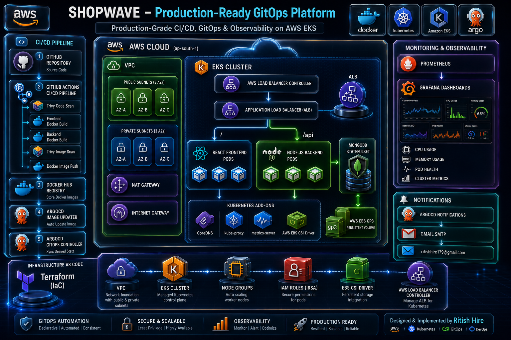

# Shopwave Cloud-Native Application GitOps Project

[](https://kubernetes.io/)
[](https://www.terraform.io/)
[](https://argoproj.github.io/cd/)
[](https://github.com/aquasecurity/trivy)
[](https://github.com/features/actions)

An enterprise-grade, GitOps-driven cloud-native application platform deployed on AWS EKS. This repository showcases GitOps automation, Infrastructure as Code (IaC), parallel security-first integration pipelines, and persistent cloud storage orchestration.

---

## 1. System Architecture


The workflow consists of:
1. **Developer Push:** Developer commits code to GitHub.
2. **GitHub Actions CI:** Triggers static scans, builds Docker images in parallel, audits images using Trivy security gates, and pushes to Docker Hub.
3. **GitOps CD (ArgoCD):** Uses the **App of Apps pattern** to pull manifests from the `k8s/` directory and deploy to EKS, maintaining absolute consistency with Git.
4. **Auto Image Update:** ArgoCD Image Updater watches the registry, automatically deploys new container versions to the EKS cluster, and commits changes back to Git.
5. **Observability:** Prometheus & Grafana monitor cluster health, while ArgoCD Notifications sends status alerts using custom dark-mode email alerts via SMTP.

---

## 2. Project Directory Layout

```bash
├── .github/workflows/            # CI pipeline (GitHub Actions build & Trivy scan tasks)
├── argocd/                       # ArgoCD GitOps root configs & templates
│   ├── apps/                     # ArgoCD application declarations (FE, BE, Database, Monitoring)
│   ├── notifications-config.yaml # SMTP configuration & dark-mode HTML templates
│   ├── notifications-secret.yaml # Encrypted SMTP credentials
│   └── root-app.yaml             # Root Application bootstrapper (App-of-Apps)
├── frontend/                     # React.js SPA frontend client (built with Vite)
├── backend/                      # Node.js/Express REST API service
├── k8s/                          # Raw Kubernetes manifests (Base templates)
│   ├── frontend/                 # Frontend Deployment, Service, and HPA configs
│   ├── backend/                  # Backend Deployment, Service, and HPA configs
│   ├── mongodb/                  # StatefulSet, Service, PVC, & custom gp3 StorageClass
│   └── ingress/                  # Ingress routing manifests
└── terraform/                    # Infrastructure-as-Code definitions
    ├── providers.tf              # Provider configuration (AWS, Helm, Kubernetes)
    ├── vpc.tf                    # AWS VPC: Subnets, NAT Gateways, Route Tables
    ├── eks.tf                    # Amazon EKS Cluster & Managed Node Group setup
    ├── iam.tf                    # IAM Policies and Roles for Service Accounts (IRSA)
    ├── helm_alb_controller.tf    # AWS Load Balancer Controller Helm chart deployment
    └── helm_argocd.tf            # Bootstrap ArgoCD controller
```

---

## 3. Technology Stack & Key Highlights

* **Infrastructure as Code (IaC):** Single-command AWS infrastructure deployment with Terraform. Spans a multi-AZ VPC, secure IAM mappings (IRSA), and high-performance managed EKS Node Groups using `c7i-flex.large` instances.
* **Security Quality Gates:** Integration of **Trivy filesystem and image scanning** directly into the GitHub Actions CI pipeline to verify zero vulnerability and secret leaks before pushing to Docker Hub.
* **Automated Continuous Delivery (GitOps):** Zero manual cluster modifications using ArgoCD. Tracks updates seamlessly with ArgoCD Image Updater and writes state back to the Git source of truth.
* **Database Workloads & Persistence:** State persistence using EKS StatefulSet bound to a custom AWS `gp3` StorageClass with EBS CSI volume mounts.
* **Traffic Ingress Controller:** Managed application routing using path-based routing rules (Nginx/ALB controllers).

---

## 4. Setup & Deployment Guide

### Prerequisites
Ensure you have the following CLI utilities installed:
* [AWS CLI](https://aws.amazon.com/cli/)
* [Terraform](https://www.terraform.io/)
* [kubectl](https://kubernetes.io/docs/tasks/tools/)

---

### Phase 1: Provision Infrastructure
1. Configure your AWS credentials:
   ```bash
   aws configure
   ```
2. Navigate to the `terraform/` directory:
   ```bash
   cd terraform
   ```
3. Initialize Terraform providers and apply configuration:
   ```bash
   terraform init
   terraform plan
   terraform apply -auto-approve
   ```
   *Note: This process takes ~15–20 minutes to provision the EKS Control Plane, AWS VPC, worker nodes, and IAM configurations.*

---

### Phase 2: Configure kubectl & ArgoCD GitOps
1. Connect your local machine to the new EKS cluster:
   ```bash
   aws eks update-kubeconfig --region ap-south-1 --name shopwave-eks
   ```
2. Verify that worker nodes are up and running:
   ```bash
   kubectl get nodes
   ```
3. Deploy the root ArgoCD bootstrap application:
   ```bash
   kubectl apply -f argocd/root-app.yaml
   ```
4. Expose the ArgoCD UI dashboard locally:
   ```bash
   kubectl port-forward svc/argocd-server -n argocd 8080:443
   ```
   *Navigate to `https://localhost:8080` to access the console (Default User: `admin`).*

---

### Phase 3: Setup Email Notifications (Gmail SMTP)
1. Generate a Base64 string of your Gmail App Password.
2. Edit `argocd/notifications-secret.yaml` and add your encoded string:
   ```yaml
   apiVersion: v1
   kind: Secret
   metadata:
     name: argocd-notifications-secret
     namespace: argocd
   type: Opaque
   data:
     email-password: <YOUR_BASE64_ENCODED_PASSWORD>
   ```
3. Deploy the notifications secret and configuration:
   ```bash
   kubectl apply -f argocd/notifications-secret.yaml
   kubectl apply -f argocd/notifications-config.yaml
   ```
4. Restart the notifications pod to apply changes:
   ```bash
   kubectl rollout restart deployment argocd-notifications-controller -n argocd
   ```

---

### Phase 4: Configure GitHub Actions CI
Add your container registry credentials to your GitHub repository (**Settings > Secrets and variables > Actions**):
* `DOCKERHUB_USERNAME`: Your Docker Hub username.
* `DOCKERHUB_TOKEN`: Your Docker Hub personal access token.

Pushing changes to the `main` branch will now trigger automated security scans, builds, and pushes. The ArgoCD Image Updater will automatically reconcile the cluster.

---

## 5. Teardown & Cleanup

To safely remove all provisioned resources and prevent ongoing AWS billing, execute:
```bash
cd terraform
terraform destroy -auto-approve
```
*Note: Ensure you delete any Kubernetes Ingress resources beforehand so that EKS can cleanly de-provision the associated AWS Load Balancer Controller assets.*
